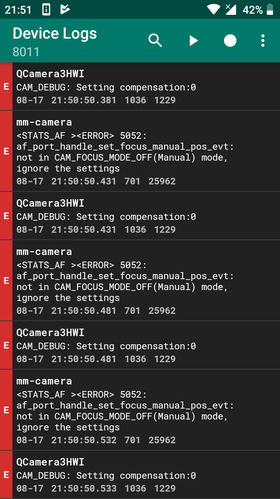

## 概要

Xiaomi Redmi 4X のバージョンが Android 9 のほとんどの ROM はニコニコ生放送アプリで生放送するとリアカメラの映像がカクカクになるバグが起きる
フロントカメラは正常

[Bliss ROM](https://forum.xda-developers.com/xiaomi-redmi-4x/development/rom-blissrom-v11-4-t3893387) のみこの問題は発生しない
Bliss はシステムの細かい不具合を修正してることが多いからこれも修正されてるんだろう
でもそれ以外はいまいち

**2019 年 8 月 28 日追記**
Bliss ROM でもマシになってるけどフレームレートは少し落ちてる

## 苦労と思考

それで Bliss ROM を使ってたんだけど、7月のアップデートを適用したら不安定になって、起動してもすぐにシャットダウンがはじまってリカバリー(TWRP)に入ってしまう不具合にあってどうしようもなくなった
しかも Titanium Backup でアプリのバックアップするの忘れてたから今からでもバックアップしようと何度も再起動したけど無駄だった
仕方なくバックアップされてないアプリのデータはあきらめた

この機会にアップデートされていた [Lineage OS DarkPhoenix](https://forum.xda-developers.com/xiaomi-redmi-4x/development/rom-lineageos-16-0-darkphoenix-t3921669) を再び試してみることにした
でもだめだった
調べてみると DarkPhoenix の[他にもビルドがある](https://forum.xda-developers.com/showpost.php?p=80015027&postcount=458)みたい
正常に動く BlissROM は違うカーネルで、DarkPhoenixカーネルの不具合を疑ってたから他のビルドを試してみた
でも下3つはどれも駄目だった
原因はカーネルじゃないみたい
ちなみに HyperTeam のを使ったらストレージを勝手に暗号化されたから注意

Logcat を使ってログを見てみた

どうやら、オートフォーカス(AF)周りに不具合が起きてるっぽい？
ちなみに問題が起きるリアカメラには PDAF が搭載されている
それと関係あるのかな？
カメラアプリは正常だから、ニコニコ生放送アプリの問題なのかな？

*[PDAF]: 位相差検出オートフォーカス

**2019 年 8 月 28 日追記**
Lineage OS 15.1 (Android 8) でも Logcat を見たけど同じエラーが出てるから無関係みたい

これまでに試してだめだった Android 9 の ROM

* [AOSP Extended](https://forum.xda-developers.com/xiaomi-redmi-4x/development/rom-aospextended-rom-v6-0-t3860268)
* [Havoc OS](https://forum.xda-developers.com/xiaomi-redmi-4x/development/rom-havoc-os-v2-3-t3908165)
* [Lineage OS 16.0 DarkPhoenix](https://forum.xda-developers.com/xiaomi-redmi-4x/development/rom-lineageos-16-0-darkphoenix-t3921669)
* [Lineage OS 16.0 nichcream](https://forum.xda-developers.com/showpost.php?p=80015027&postcount=458)
* [Lineage OS 16.0 HyperTerm](https://forum.xda-developers.com/showpost.php?p=80015027&postcount=458)

## 結果

というわけで ROM は結局 [Lineage OS の公式バージョンの 15.1 (Android 8)](https://forum.xda-developers.com/xiaomi-redmi-4x/development/rom-2017-08-07lineage-14-1-t3653016) にした
品質にこだわってる Lineage OS の公式が 15.1 のままなのはこれが理由？

ちなみにいろんな ROM を試してみて気に入ったのは

* UI は Lineage OS
* 機能は Havoc OS
