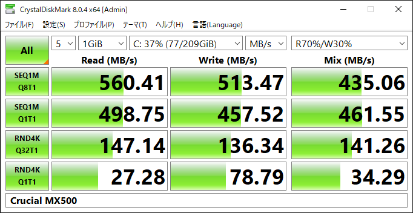

今年の上半期のいつかにAliExpressでポチってほったらかしていたSSD、MiWhole D200(2TB)を今更開封

まぁDRAMレスQLCのゴミですね…
NVMeは外付け化できないという思い込みでMiWhole CT300を買わずにSATAのこっち買ってしまった

メインドライブの Crucial MX500(500GB) のCrystalDiskMarkによるベンチマーク結果

## 2024年8月15日追記

1年弱使っての感想
初めの頃は問題なかった
一時的なファイルを置いたりゲーム用に使っていた

しかし録画データが溜まっていって空き容量が半分を切ったあたりから様子がおかしくなる…
大容量の書き込みを行うとフリーズしてどうにもならなくなるのだ
一応ある程度までなら何時間も待つことでフリーズが解消するけど、ひどいと数日待ってもだめだった

更には別にたくさん書き込んだ覚えはないのに途端にフリーズが発生するように
幸いこれは数分で解消する

あとゲームプレイ中にフリーズしてしまうことも…
ゲーム用としても用をなさない始末

%207_08_08.jxl)

S.M.A.R.T.はこんなん

買ったばかり

デフラグツールの表示

*H:* が該当
断片化はしていない様子

CT300にしておけばよかった
蝉が優秀なだけだったんだ
