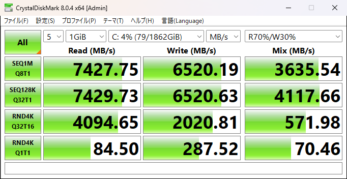
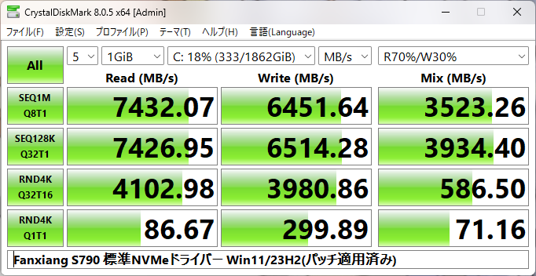
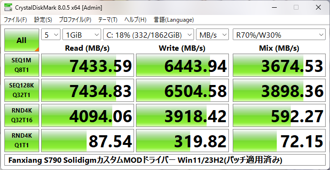

NANDにYMTC製232層TLC、コントローラにMaxio MAP1602を搭載した、いわゆる蝉族と呼ばれるHIKSEMI FUTUREの同等品。

## ベンチマーク

### CrystalDiskMark

[CrystalDiskMark_20240106054115_S790.txt](./CrystalDiskMark_20240106054115_S790.txt)

> ------------------------------------------------------------------------------
> CrystalDiskMark 8.0.4 x64 (C) 2007-2021 hiyohiyo
>                                   Crystal Dew World: https://crystalmark.info/
> ------------------------------------------------------------------------------
> * MB/s = 1,000,000 bytes/s [SATA/600 = 600,000,000 bytes/s]
> * KB = 1000 bytes, KiB = 1024 bytes
> 
> [Read]
>   SEQ    1MiB (Q=  8, T= 1):  7427.749 MB/s [   7083.7 IOPS] <   987.81 us>
>   SEQ  128KiB (Q= 32, T= 1):  7429.732 MB/s [  56684.4 IOPS] <   546.67 us>
>   RND    4KiB (Q= 32, T=16):  4094.649 MB/s [ 999670.2 IOPS] <   494.56 us>
>   RND    4KiB (Q=  1, T= 1):    84.503 MB/s [  20630.6 IOPS] <    48.38 us>
> 
> [Write]
>   SEQ    1MiB (Q=  8, T= 1):  6520.188 MB/s [   6218.1 IOPS] <  1258.72 us>
>   SEQ  128KiB (Q= 32, T= 1):  6520.628 MB/s [  49748.4 IOPS] <   640.06 us>
>   RND    4KiB (Q= 32, T=16):  2020.814 MB/s [ 493362.8 IOPS] <  1021.30 us>
>   RND    4KiB (Q=  1, T= 1):   287.520 MB/s [  70195.3 IOPS] <    14.16 us>
> 
> [Mix] Read 70%/Write 30%
>   SEQ    1MiB (Q=  8, T= 1):  3635.544 MB/s [   3467.1 IOPS] <  2303.51 us>
>   SEQ  128KiB (Q= 32, T= 1):  4117.665 MB/s [  31415.3 IOPS] <  1016.07 us>
>   RND    4KiB (Q= 32, T=16):   571.979 MB/s [ 139643.3 IOPS] <  3640.51 us>
>   RND    4KiB (Q=  1, T= 1):    70.461 MB/s [  17202.4 IOPS] <    58.03 us>
> 
> Profile: Default
>    Test: 1 GiB (x5) [C: 4% (79/1862GiB)]
>    Mode: [Admin]
>    Time: Measure 5 sec / Interval 5 sec 
>    Date: 2024/01/06 5:41:48
>      OS: Windows 11  [10.0 Build 22631] (x64)

#### SolidigmカスタムMODドライバーでの結果

https://www.techpowerup.com/forums/threads/solidigm-nvme-custom-modded-driver-for-all-nvme-brands-ssds-any-nvme-ssds.327143/

これはWindowsの標準NVMeドライバーよりランダムアクセスが早い改造バージョンのNVMeドライバーだ。

RND4KQ1T1のWriteのみ少し向上した。

そもそも標準ドライバーでも性能が上がっているのは

- Windows 11のZen4への最適化
- Spectre緩和策の無効化
- VBSの無効化

などが影響したと考えられる。
