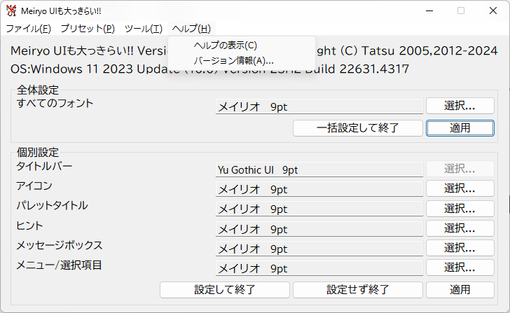

## クロスプラットフォーム

## Windows

### Meiryo UIも大っきらい!!

:::tip
使用前に以下のコマンドでレジストリのバックアップを作成することが推奨されています。
`REG SAVE "HKCU\Control Panel" %LOCALAPPDATA%\noMeiryoUI_HKCU.reg /y`
:::

システムフォントを簡単に変更できるツール。
レジストリの編集でも同じことはできるが、繰り返しの操作が多く{煩雑|はんざつ}であった。

https://github.com/Tatsu-syo/noMeiryoUI

### Meiryo_Ke

> MeiryoKeは メイリオ フォントを改造したフォントセットです。

https://meir000.github.io/MeiryoKe/

### NanaZip

https://github.com/M2Team/NanaZip

圧縮・展開を行うGUIプログラム。
7-Zipのフォークであり「ダークモード」「Mica」などの最新のWindows 11 UIに対応した。
機能面では「Zstandard」「Lizard」などの最新のコーデックに対応している。
[公式で紹介されているすべての特徴](https://github.com/M2Team/NanaZip?tab=readme-ov-file#features)

`winget install --id M2Team.NanaZip --interactive` // インストーラを表示する
`winget install --id M2Team.NanaZip` // 無人インストール
