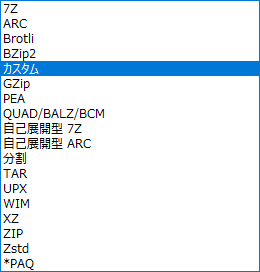
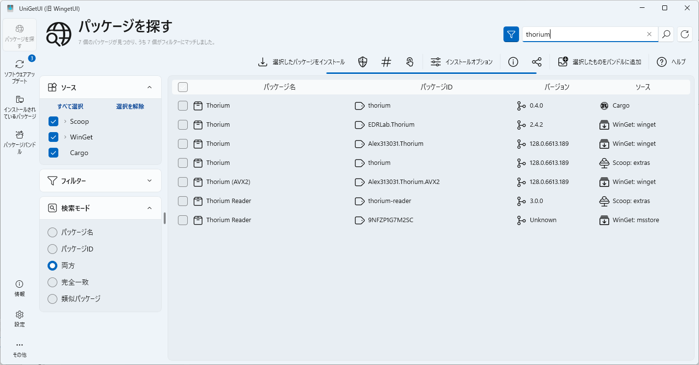
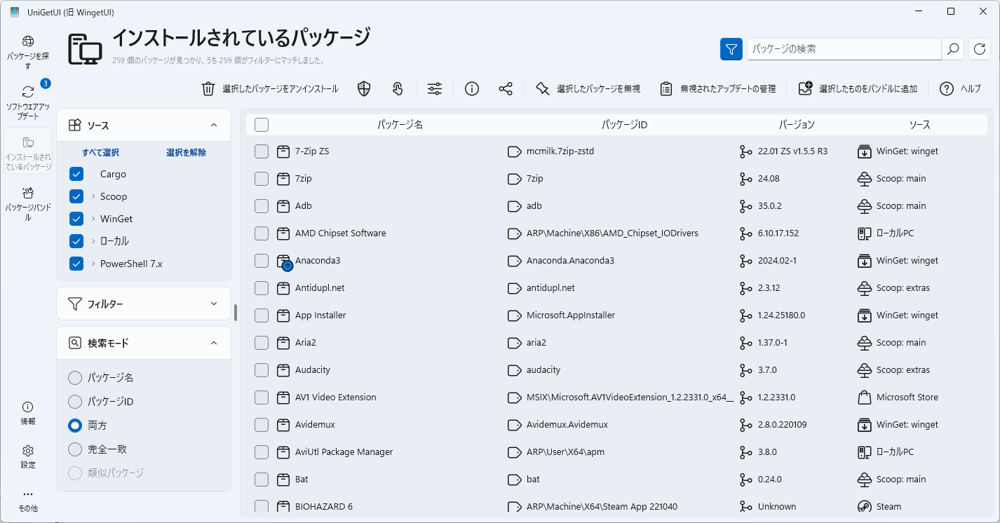
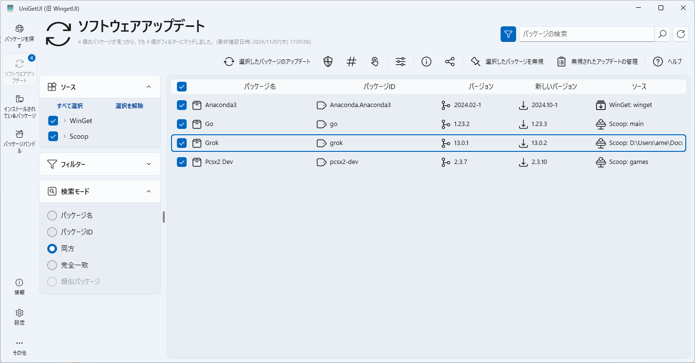
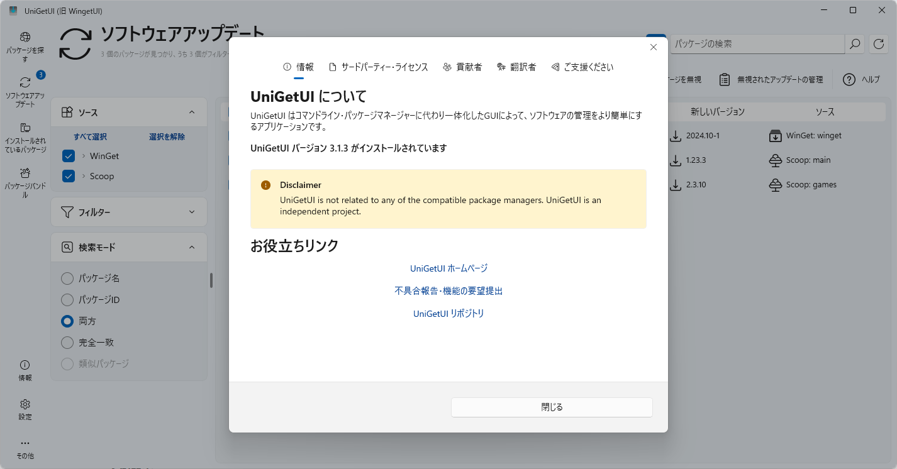
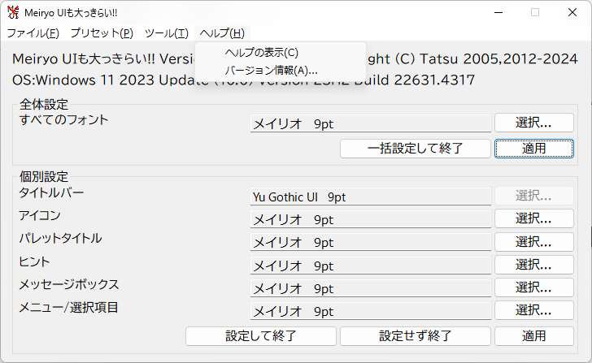

## クロスプラットフォーム

複数のOSで動作するもの。

### Kopia

バックアップソフトウェア。

### VSCodium

FLOSSのスケーラブルな高性能エディタ。
プログラミングから文章作成まで、様々な用途で使用できる。
プログラミングにおいては定番だ。

https://vscodium.com/

`winget install vscodium --interactive` // インストーラーを表示してインストール
`winget install vscodium` // 無人インストール

### PeaZip

- [公式サイト](https://peazip.github.io/index.html)
- [ベンチマーク結果](https://peazip.github.io/peazip-compression-benchmark.html)

クロスプラットフォーム対応の、CLIとGUIに両対応したアーカイバー。

対応している形式:

- 7z
  - 自己展開型 7Z
- ARC
  - 自己展開型 ARC
- Brotil
- BZip2
- GZip
- [PEA](https://peazip.github.io/pea-file-format.html)
- QUAD/BALZ/BCM
- 分割
- TAR
- [UPX (※実行ファイル向けの圧縮形式)](https://upx.github.io/)
- WIM
- XZ
- Zip
- Zstandard (Zstd)
- ZPAQ

残念ながら[lz4(※圧縮率を上げても不変な高速な展開速度が特徴)](https://github.com/lz4/lz4)には非対応のようだ。

*PEA*はおそらく独自のものっぽいが圧縮アルゴリズムはただのZlibのdeflateであり大したことはない[^pea-algo]。

[^pea-algo]: https://peazip.github.io/pea-file-format.html

### NormCap

- [公式サイト](https://dynobo.github.io/normcap/)
- [GitHub](https://github.com/dynobo/normcap)

画面からOCR技術によりテキストを読み取ってクリップボードにコピーしてくれる。

- テキストかと思ったら画像でした
- 画像やゲーム画面の中の英語が読めない

こんな状況を解決してくれる。

またQRコードとバーコードにも対応しているようだ。

## Windows

Windowsでのみ使えるか、使う必要のあるもの。

### UniGetUI

各種パッケージマネージャーのGUIフロントエンド。

GUIから複数のパッケージマネージャーを横断してパッケージを検索してインストールしたり、インストールされているパッケージをまとめて更新したりできる。

https://www.marticliment.com/unigetui/

### Meiryo UIも大っきらい!!

:::tip
使用前に以下のコマンドでレジストリをバックアップすることが推奨されています。
`REG SAVE "HKCU\Control Panel" %LOCALAPPDATA%\noMeiryoUI_HKCU.reg /y`
:::

システムフォントを簡単に変更できるツール。
レジストリの編集でも同じことはできるが、繰り返しの操作が多く{煩雑|はんざつ}になる。

https://github.com/Tatsu-syo/noMeiryoUI

### Meiryo_Ke

> MeiryoKeは メイリオ フォントを改造したフォントセットです。

https://meir000.github.io/MeiryoKe/

### DWMBlurGlass

Windows 10|11にAeroのような半透明な視覚効果を付与できる。

> これらの画像は公式リポジトリより

OpenGlassとの違い

- GUIですべてが完結するため、初心者向け
- Windows 10|11のスタイルにマッチしている
- 10|11の雰囲気を尊重しつつそこに透過効果をもたらすのにいいかも？

https://github.com/Maplespe/DWMBlurGlass

### OpenGlass

DWMBlurGlassとの違い

- バッチファイルを使ったり設定はレジストリで行うなど、上級者向け
- Windows 7のスタイルに忠実
- Aeroテーマとの相性が良い
- Vista|7のより精巧な再現をもとめるのにいいかも？

💡ヒント: [Aero7-11テーマ](https://github.com/LittleFox2024/Aero7-11)と併用するとよいだろう。

https://github.com/ALTaleX531/OpenGlass

### NanaZip

https://github.com/M2Team/NanaZip

圧縮・展開を行うGUIプログラム。
7-Zipのフォークであり「ダークモード」「Mica」などの最新のWindows 11 UIに対応した。
機能面では「Zstandard」「Lizard」などの最新のコーデックに対応している。
[公式で紹介されているすべての特徴](https://github.com/M2Team/NanaZip?tab=readme-ov-file#features)

`winget install --id M2Team.NanaZip --interactive` // インストーラを表示する
`winget install --id M2Team.NanaZip` // 無人インストール

### ImageGlass

:::warning
インストールやアップデートで必ずデスクトップにショートカットを生成します。
:::

https://github.com/d2phap/ImageGlass

画像表示ソフトウェア。

`winget install --id DuongDieuPhap.ImageGlass --interactive` // インストーラを表示する
`winget install --id DuongDieuPhap.ImageGlass` // 無人インストール

[UniGetUIで表示](https://marticliment.com/unigetui/share/?name=ImageGlass&id=DuongDieuPhap.ImageGlass&sourceName=winget&managerName=WinGet)

Microsoft Storeからもインストールできるが有料となる。
