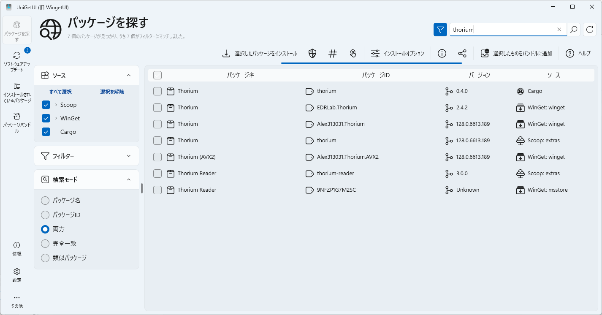
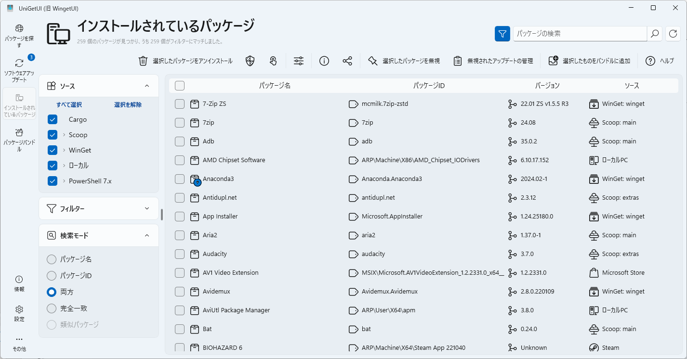
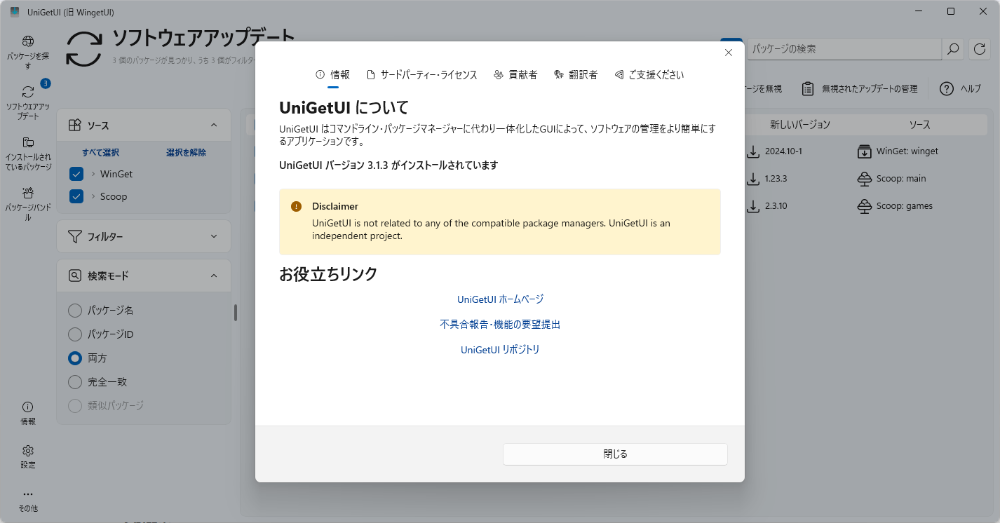

## クロスプラットフォーム

複数のOSで動作するもの。

## Windows

Windowsでのみ使える、または使う必要のあるもの。

### UniGetUI

各種パッケージマネージャーのGUIフロントエンド。

GUIから複数のパッケージマネージャーを横断してパッケージを検索してインストールしたり、インストールされているパッケージをまとめて更新したりできる。

https://www.marticliment.com/unigetui/

### Meiryo UIも大っきらい!!

:::tip
使用前に以下のコマンドでレジストリのバックアップを作成することが推奨されています。
`REG SAVE "HKCU\Control Panel" %LOCALAPPDATA%\noMeiryoUI_HKCU.reg /y`
:::

システムフォントを簡単に変更できるツール。
レジストリの編集でも同じことはできるが、繰り返しの操作が多く{煩雑|はんざつ}になる。

https://github.com/Tatsu-syo/noMeiryoUI

### Meiryo_Ke

> MeiryoKeは メイリオ フォントを改造したフォントセットです。

https://meir000.github.io/MeiryoKe/

### DWMBlurGlass

Windows 10|11にAeroのような半透明な視覚効果を付与できる。

> これらの画像は公式リポジトリより

https://github.com/Maplespe/DWMBlurGlass

### NanaZip

https://github.com/M2Team/NanaZip

圧縮・展開を行うGUIプログラム。
7-Zipのフォークであり「ダークモード」「Mica」などの最新のWindows 11 UIに対応した。
機能面では「Zstandard」「Lizard」などの最新のコーデックに対応している。
[公式で紹介されているすべての特徴](https://github.com/M2Team/NanaZip?tab=readme-ov-file#features)

`winget install --id M2Team.NanaZip --interactive` // インストーラを表示する
`winget install --id M2Team.NanaZip` // 無人インストール

### ImageGlass

:::warning
インストールやアップデートで必ずデスクトップにショートカットを生成します。
:::

https://github.com/d2phap/ImageGlass

画像表示ソフトウェア。

`winget install --id DuongDieuPhap.ImageGlass --interactive` // インストーラを表示する
`winget install --id DuongDieuPhap.ImageGlass` // 無人インストール

[UniGetUIで表示](https://marticliment.com/unigetui/share/?name=ImageGlass&id=DuongDieuPhap.ImageGlass&sourceName=winget&managerName=WinGet)

Microsoft Storeからもインストールできるが有料となる。
